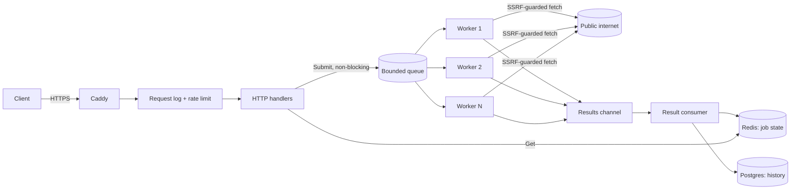

# GoDrop

An asynchronous URL-fetching job service written in Go. Submit a URL over HTTP, get a job ID back immediately, and a pool of concurrent workers fetches it in the background. Poll for the result, and every finished job is also recorded in a permanent history. Think of it as a small Celery in Go: the same producer/queue/worker shape, built on goroutines and channels instead of a broker.

It started as a way to learn Go by building something realistic, and grew into a service that is safe to expose to the internet: rate limited, SSRF-protected, containerised, and served over automatic HTTPS.

## Features

- **Async job API.** `POST /jobs` returns `202` and an ID in microseconds; the fetch happens in the background.
- **Generic worker pool.** `Pool[T, R]` runs any job type through a `Processor[T, R]` interface. Fixed number of workers, bounded queue, per-job timeouts.
- **Backpressure.** A full queue is refused immediately with `503` and `Retry-After`, instead of piling up requests.
- **Graceful shutdown.** On `SIGINT`/`SIGTERM` the server stops accepting requests, lets in-flight jobs finish, and drains the queue (bounded by a timeout).
- **Two stores, two jobs.** Redis holds live job state (fast lookups, expires after a TTL). Postgres holds an append-only history of finished jobs. Both are optional; without them the service runs fully in memory.
- **SSRF protection.** The service fetches URLs that strangers give it, so it refuses to connect to loopback, private, link-local (cloud metadata) and other non-public addresses. The check runs on the resolved IP at connect time, so it also covers redirects, odd IP encodings and DNS tricks.
- **Per-client rate limiting.** Token bucket per client address, `429` with `Retry-After`, and `X-Forwarded-For` trusted only when explicitly enabled.
- **Structured logging.** `log/slog` with JSON or text output, request logging, and a `job_id` on every line about a job.
- **Configuration from the environment.** Defaults, then `GODROP_*` variables, then flags, all validated at startup.
- **Small deployable image.** Multi-stage build, about 25 MB, non-root, with a health check. Caddy in front provides HTTPS.

## Architecture



Life of a job:

1. `POST /jobs` validates the URL, saves a `queued` record, and submits the job to the pool. If the queue is full the record is removed and the client gets `503`.
2. A worker takes the job and fetches the URL with a per-job timeout.
3. The result goes onto a channel. A single consumer saves the final `done` or `failed` record to the job store, then appends it to the history (best effort; a history failure never affects the job).
4. `GET /jobs/{id}` reads the record from the job store.

## API

All bodies are JSON.

| Method | Path | Description |
|---|---|---|
| `POST` | `/jobs` | Submit a URL. Body: `{"url": "https://example.com"}`. Returns `202` with `{"id": "..."}` and a `Location` header. |
| `GET` | `/jobs/{id}` | Job state and result. `404` if unknown or expired. |
| `GET` | `/history?limit=N` | Most recent finished jobs from Postgres, newest first. `limit` is 1 to 100 (default 20). |
| `GET` | `/healthz` | Liveness check. Never rate limited. |

A job record:

```json
{
  "id": "GEO4DVBGVTQIL6NJ4SRUXQGXNM",
  "url": "https://example.com",
  "status": "done",
  "status_code": 200,
  "duration_ms": 188,
  "created_at": "2026-09-26T09:10:47.031Z"
}
```

`status` is `queued`, `done` or `failed`. A failed job carries an `error` string instead of a `status_code`. A `404` from the target site is not a failure: the site answered, so the job is `done` with `status_code: 404`.

Error responses:

| Status | Meaning |
|---|---|
| `400` | Invalid JSON, or a URL that is not `http://` or `https://`. |
| `404` | Unknown job ID. |
| `429` | Rate limit exceeded. Honour `Retry-After`. |
| `503` | Queue full. Retry after `Retry-After`. |

Try it:

```bash
curl -X POST http://localhost/jobs -d '{"url":"https://example.com"}'
# {"id":"GEO4DVBGVTQIL6NJ4SRUXQGXNM"}

curl http://localhost/jobs/GEO4DVBGVTQIL6NJ4SRUXQGXNM
curl 'http://localhost/history?limit=5'
```

## Quick start (Docker Compose)

Requires Docker with the Compose plugin.

```bash
cp .env.example .env
# edit .env: set POSTGRES_PASSWORD to something real

docker compose up -d --build --wait
curl http://localhost/healthz
```

This starts four services: `app`, `redis`, `postgres` and `caddy`. Caddy is the only one reachable from outside the Compose network.

Locally, `docker-compose.override.yml` is merged in automatically. It publishes Redis (`6380`), Postgres (`5433`) and the app itself (`8080`) on `127.0.0.1` only, so you can use `redis-cli`, `psql`, or hit the app directly. That file is for development; do not use it on a server (see [Deployment](#deployment)).

Stop everything with `docker compose down`. Data lives in named volumes and survives; add `-v` only if you want to wipe it.

## Local development

Run the dependencies in Docker and the server from source:

```bash
docker compose up -d redis postgres

go run ./cmd/server \
  -redis 127.0.0.1:6380 \
  -postgres 'postgres://godrop:<password>@127.0.0.1:5433/godrop?sslmode=disable' \
  -allow-private-urls
```

`-allow-private-urls` lets jobs fetch `127.0.0.1` and other private addresses, which you need to test against a local server (for example `tmp/slow.py`, a test server that answers after one second on port 8099). It is off by default and must never be enabled in production. The server logs a warning when it is on.

With no `-redis` and no `-postgres`, the server keeps job state in memory and records no history, which is enough for trying it out:

```bash
go run ./cmd/server -allow-private-urls
```

The server also reads a `.env` file from the working directory if one exists. Real environment variables win over `.env`, and flags win over both.

### Batch CLI

`cmd/cli` is the original command-line version: it reads URLs from a file and fetches them with a worker pool, printing one line per URL.

```bash
go run ./cmd/cli -file testdata/urls.txt -workers 5 -timeout 5s
```

Press Ctrl+C to stop gracefully: in-flight fetches finish, the rest are skipped, and a second Ctrl+C exits immediately.

## Configuration

Every setting can come from a `GODROP_*` environment variable or a flag. Priority: defaults, then environment, then flags.

| Environment variable | Flag | Default | Description |
|---|---|---|---|
| `GODROP_ADDR` | `-addr` | `:8080` | Address the HTTP server listens on. |
| `GODROP_WORKERS` | `-workers` | `5` | Concurrent workers. |
| `GODROP_QUEUE` | `-queue` | `100` | Jobs that may wait for a free worker. |
| `GODROP_JOB_TIMEOUT` | `-timeout` | `10s` | Per-job timeout. |
| `GODROP_REDIS_ADDR` | `-redis` | empty | Redis address. Empty keeps job state in memory. |
| `GODROP_JOB_TTL` | `-job-ttl` | `24h` | How long a job record is kept in Redis. |
| `GODROP_POSTGRES_DSN` | `-postgres` | empty | Postgres DSN. Empty disables job history. Contains a password, never logged. |
| `GODROP_LOG_LEVEL` | `-log-level` | `info` | `debug`, `info`, `warn` or `error`. |
| `GODROP_LOG_FORMAT` | `-log-format` | `text` | `text` or `json`. |
| `GODROP_RATE_LIMIT` | `-rate-limit` | `10` | Sustained requests per second per client. `0` turns limiting off. |
| `GODROP_RATE_BURST` | `-rate-burst` | `20` | Requests a client may send at once. |
| `GODROP_TRUST_PROXY` | `-trust-proxy` | `false` | Read the client address from `X-Forwarded-For`. Only enable behind a proxy you control. |
| `GODROP_ALLOW_PRIVATE_URLS` | `-allow-private-urls` | `false` | Let jobs fetch private and loopback addresses. Development only. |
| `GODROP_SHUTDOWN_TIMEOUT` | | `10s` | Wait for in-flight HTTP requests on shutdown. |
| `GODROP_DRAIN_TIMEOUT` | | `30s` | Wait for queued jobs to finish on shutdown. |

Docker Compose also reads:

| Variable | Description |
|---|---|
| `POSTGRES_PASSWORD` | Required. Used by the `postgres` service and to build the app's DSN. Compose refuses to start without it. |
| `SITE_ADDRESS` | Caddy's site address. Defaults to `http://localhost` (plain HTTP). Set it to your domain for automatic HTTPS. |

## Project layout

```
cmd/
  server/           HTTP service (the main program)
  cli/              batch URL fetcher
internal/
  pool/             generic worker pool: Pool[T, R], Processor, workers, Feed
  processor/        the URL Fetcher (a pool.Processor)
  job/              BaseJob, URLJob, Status
  store/            JobStore and HistoryStore interfaces; memory and Redis stores
  database/         Postgres connection, embedded migrations, job history
  api/              handlers, request logging, rate limiting
  netguard/         SSRF protection: refuses non-public addresses at connect time
  config/           defaults, env and flags, validation
  logging/          slog setup
tests/              unit and integration tests
Dockerfile          multi-stage build, non-root, health check
docker-compose.yml  app, redis, postgres, caddy
Caddyfile           reverse proxy, security headers, HTTPS
```

## Testing

```bash
go vet ./...
go test -race ./tests
```

The tests cover the pool, the API (through `httptest`), config parsing, rate limiting, logging, and the SSRF guard, including redirects to internal addresses. Always run them with `-race`; much of this code is concurrent.

The Redis and Postgres tests need real servers. They use `127.0.0.1:6380` and `127.0.0.1:5433` by default (what `docker compose up -d redis postgres` publishes locally), and can be pointed elsewhere with `REDIS_TEST_ADDR` and `POSTGRES_TEST_DSN`. When a server is not reachable those tests are skipped, not failed. They use random IDs and clean up after themselves.

## Deployment

Target: one small VPS running the Compose stack, with a domain pointed at it.

1. Provision a server, allow only SSH, 80 and 443 in the firewall, and install Docker.
2. Point a DNS `A` record at the server.
3. Clone the repository and create `.env` with a generated `POSTGRES_PASSWORD` and `SITE_ADDRESS=your.domain.example`. Do not set `GODROP_ALLOW_PRIVATE_URLS`.
4. Start the stack **without** the development override:

   ```bash
   docker compose -f docker-compose.yml up -d --build --wait
   ```

Caddy obtains and renews the certificate on its own. Redis and Postgres are never published, and `GODROP_TRUST_PROXY` is already set to `true` in the Compose file because Caddy is the only way in.

To update: `git pull && docker compose -f docker-compose.yml up -d --build --wait`. To back up, dump Postgres (`docker compose exec -T postgres pg_dump -U godrop godrop | gzip > backup.sql.gz`) and copy the file off the server. Redis holds only short-lived job state and is not worth backing up.

## Design notes and known limitations

- **The queue is in memory.** Job records survive a restart (Redis), but jobs that were queued or running when the process stopped are lost, and their records stay `queued`. Shutdown drains the queue within `GODROP_DRAIN_TIMEOUT` to keep this rare. Moving the queue into Redis would fix it and is the natural next step.
- **Job IDs are the only access control.** IDs are 128 bits of randomness and cannot be guessed, but there are no accounts or API keys: anyone with an ID can read that job, and anyone who can reach the service can submit jobs (limited by the rate limiter). Add API keys before offering it to users you do not know.
- **The rate limiter is per process.** Fine for a single instance; with several instances behind a load balancer each would allow the full rate. IPv6 clients are limited per address, not per `/64` prefix.
- **Redis has no password.** It is not published and only reachable inside the Compose network, but adding `requirepass` is worthwhile hardening.
- **Any port on a public host is fetchable.** The SSRF guard blocks non-public addresses, not unusual ports.
- **Migrations are minimal.** The SQL files are embedded and run on every start, so they must be idempotent (`CREATE ... IF NOT EXISTS`). A migration tool such as goose would be needed for schema changes.
- **Responses are capped at 1 MiB** when read, so one URL cannot hold a worker downloading indefinitely.
